### Atividade Prática do Curso Introdução à Inteligência Artificial

# Análise Exploratória de Dados - 🚗 Uber 

Este projeto é uma análise da [base de dados de reservas de corridas da empresa Uber no ano de 2024](https://www.kaggle.com/datasets/yashdevladdha/uber-ride-analytics-dashboard/data). O objetivo é realizar uma análise exploratória dos dados (AED) para apontar padrões e variáveis relevantes, como parte da atividade prática do curso de Introdução ao Data Science oferecido pelo Lab365 no contexto do programa SCTEC.

### 📚 Bibliotecas e extensões utilizadas

Esta atividade foi realizada utilizando a linguagem Python e um ambiente virtual para o controle de bibliotecas. As bibliotecas utilizadas foram:
- Pandas, para manipulação e análise de dados;
- Matplotlib, biblioteca base para visualização de dados;
- Seaborn, para visualizações das relações entre os dados;
- Squarify, para plotagem de um mapa de árvore (treemap) na análise de localidade.

Optei por utilizar a extensão Jupyter Notebook no VS Code na realização análise, como forma de praticar o uso de notebooks (formato utilizado nas aulas do curso, embora via Kaggle).

### 📂 Carregamento, reconhecimento e preparação dos dados

Os primeiros blocos do notebook carregam os dados em um dataframe e permitem conhecer suas informações, em especial quantidades de registros e colunas.

A partir desse reconhecimento, a presente exploração de dados focou em entender quais variáveis estavam relacionadas e poderiam, portanto, ser potencialmente preditivas do preço de uma corrida do Uber.

Além de excluir registros duplicados, na etapa de preparação dos dados optei por eliminar as linhas em que o preço e a distância da corrida estavam nulos. Apesar de reduzir o número de registros disponíveis para análise, isso garantiu que cada ponto na análise de preço e distância fosse baseado em dados reais, evitando distorções que poderiam ser causadas por preenchimentos desses valores com a média ou mediana. A amostra continuou com um total de 102.000 registros.

### 📊 Análise dos dados

#### Preço da corrida e distância da corrida

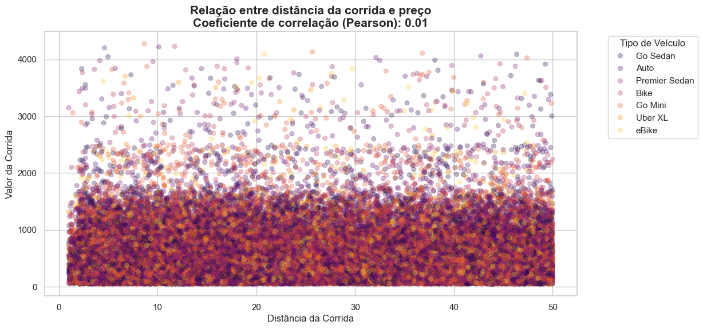

Para minha surpresa, sem levar em conta outras dimensões, não apareceu nenhuma relação entre as variáveis distância e o preço pago pela corrida. No gráfico acima foram até aplicadas cores para as diferentes categorias de veículos para verificar a possibilidade de algum padrão aparente, ainda sem resultados claros. Verificaremos a hora do dia a seguir.

#### Quantidade de corridas por hora do dia

O gráfico abaixo mostra a quantidade de corridas para cada hora do dia, o que podemos entender como o volume de demanda ao longo de um dia. O resultado é a presença de dois picos de demanda.

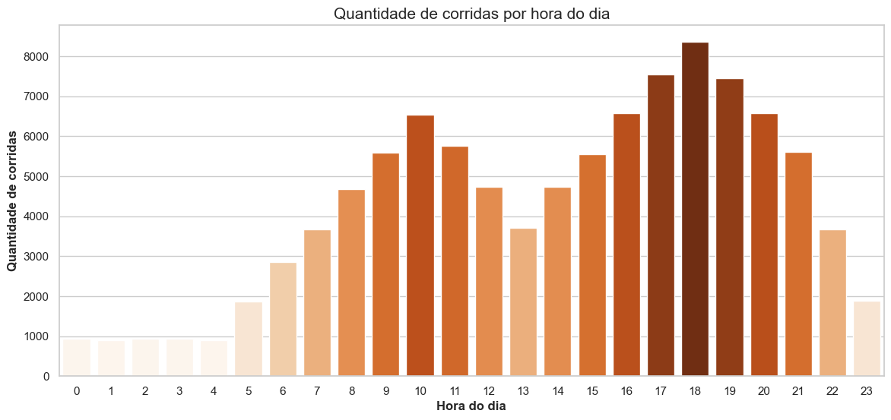

#### Preço médio da corrida por hora do dia:

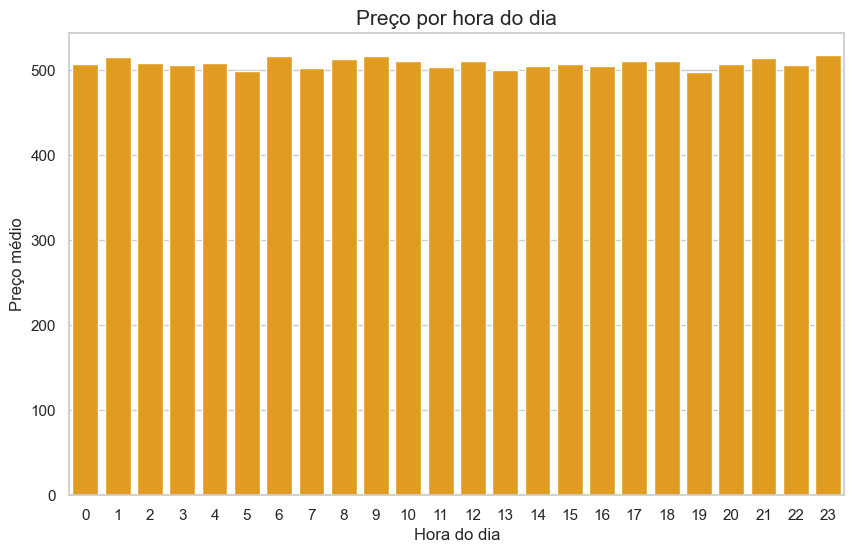

Analisando se esse volume de demanda tem alguma relação com os valores das corridas, mais uma vez, não foi encontrada nenhuma relação aparente. Apesar do volume de demanda variar ao longo do dia, os preços seguem mais ou menos constantes. O horário não parece ser um fator determinante para o preço da corrida.

#### Preço médio da corrida por dia da semana:

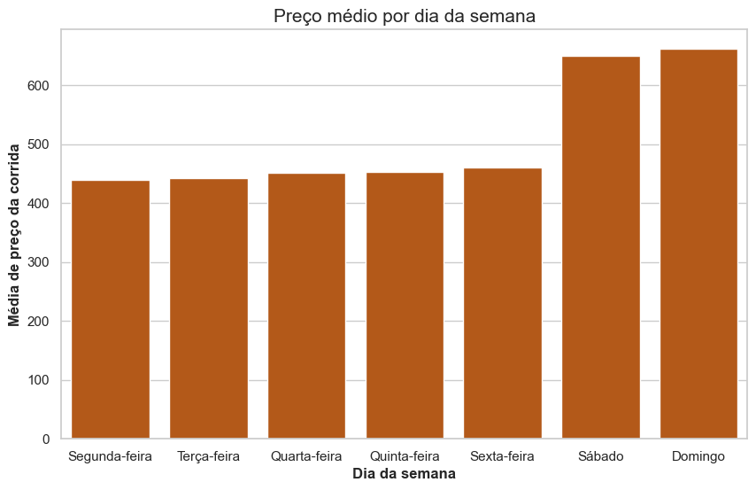

Outra possibilidade de caráter temporal são os dias da semana. Aqui sim, finalmente, encontramos um padrão: os preços são mais altos nos finais de semana. Seriam mais altos em função do aumento de demanda?

#### Quantidade de corridas por dia da semana:

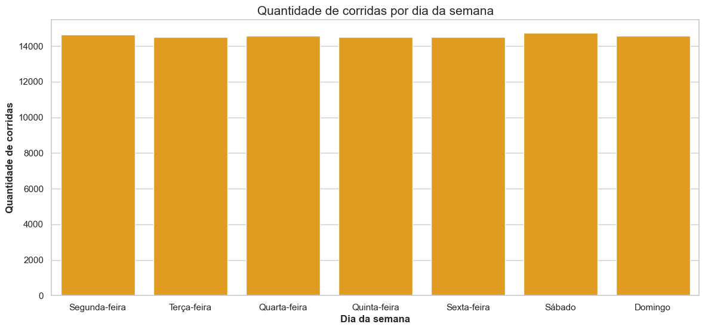

A resposta para a pergunta anterior é que não, não existe aumento de demanda nos fins de semana, conforme o gráfico acima mostra. O aumento de preços nos sábados e domingos deve estar relacionado a outros fatores, como talvez a mera disposição para pagar mais nos fins de semana — explorada pela empresa.

#### Mapa de calor de correlação entre variáveis numéricas:

Em busca de que outras variáveis poderiam se relacionar com o preço da corrida, recrutamos a plotagem de um mapa de calor com a correlação entre as variáveis numéricas disponíveis no dataset.

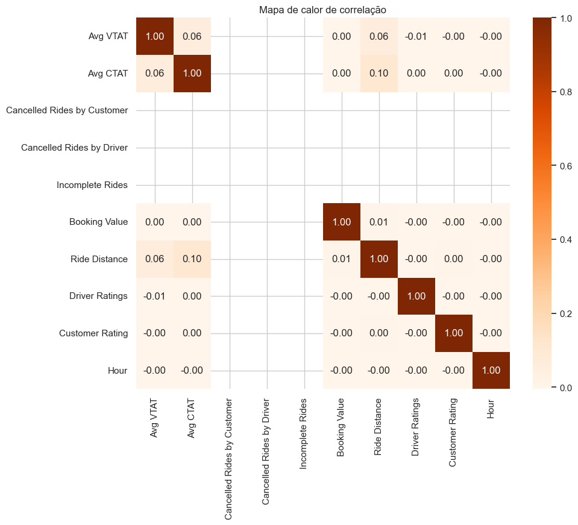

Mas não foi encontrada nenhuma relação. Aqui, é interessante saber que, por exemplo, a avaliação da pessoa motorista não afeta os preços das corridas.

#### Preço e categoria de corrida:

Seguindo adiante em busca de variáveis que se relacionam com o preço, plotamos os preços das corridas nas diferentes categorias de veículos presentes no dataset:

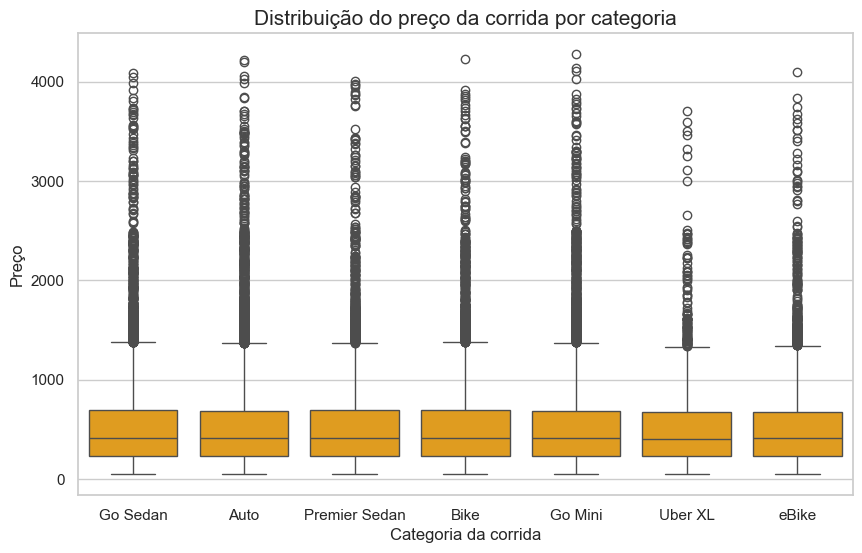

Mais uma vez, infrutífera.

#### Preço e distância dentro de uma mesma categoria de veículo:

Para descartar o tipo de veículo como categoria de análise, foi analisada novamente a possível relação entre distância e preço da corrida, agora dentro de uma única categoria. Foi escolhida a categoria "Auto", por ser a categoria com maior número de registros no dataset.

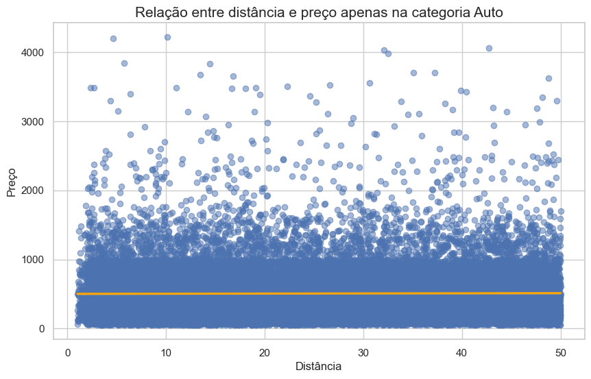

Nenhuma relação encontrada. A distância da corrida não tem relação com o preço, mesmo dentro de uma mesma categoria de veículo.

#### Preço e mês do ano:

Caso no ano de 2024 (ano do nosso conjunto de dados) a inflação tenha aumentado significativamente os valores da corrida, não considerar os diferentes meses do ano poderia nos impedir de perceber outros efeitos de relação. Novamente algo que se mostrou falso: não houve grandes tendências sazonais ou mensais.

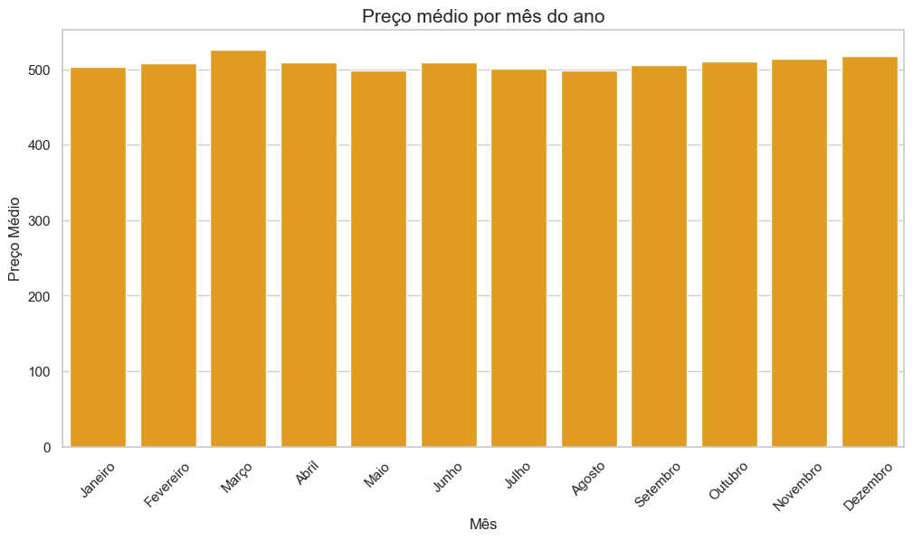

#### Preço e localidade:

O último suspiro: localidade. Talvez o local de início ou fim da corrida seja um fator determinante do preço. Aqui, utilizei o preço mediano (e não médio) para evitar distorções de possíveis anomalias (outliers). Como o dataset continha 176 localidades possíveis na coluna "Pickup Location" e "Drop Location", utilizei um mapa de árvore (treemap) para tentar visualizar a relação entre localidade e preço, onde o tamanho do retângulo representa a quantidade de corridas e a cor representa o preço mediano. As plotagens representam um recorte de 40 localidades da amostragem:

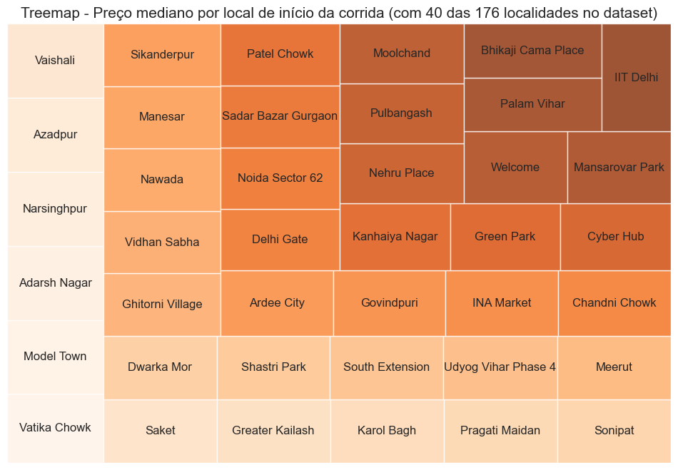
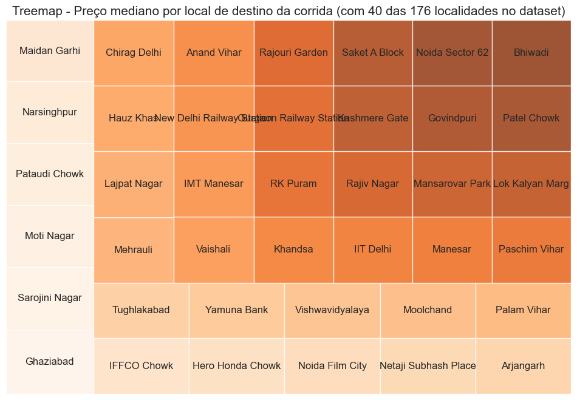

Eureca! Tanto local de origem e o local de destino da corrida aparentemente têm forte relação com o preço da corrida. Os dados sugerem que a empresa adota uma estratégia de precificação georreferenciada, baseada na segmentação por localidade.

#### Preço e distância com uma mesma localidade de origem.

(Ou: o fim é o início). Por fim, retorno uma terceira vez para a minha suspeita original de que embora a localidade seja um fator muito mais determinante do preço da corrida, a distância ainda pode ter um papel importante, desde que medida dentro de uma mesma localidade. O que mais uma vez, não foi o caso. Mesmo com o mesmo local de origem, a distância da corrida não mostrou ter relação com o preço.

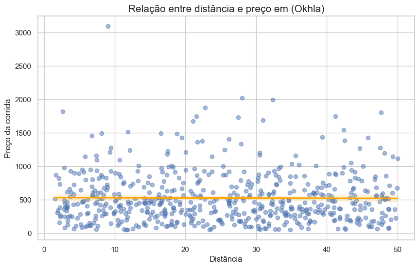

Foi selecionada aqui a localidade com maior mediana de preço (Okhla) e mais uma vez usada a mediana para evitar o efeito de outliers presente nas médias.

### 💬 Considerações finais

Essa foi uma viagem mais longa do que eu esperava, mesmo tendo feito um recorte bem específico (preço da corrida). A análise exploratória de dados é um processo iterativo que nos mostra caminhos por onde não seguir tanto ou bem mais do que caminhos por onde seguir. Por isso, optei por manter neste relatório também as ausências de relação entre as variáveis que surgiram ao longo do percurso. No caso da presente base de dados da Uber, eu esperava encontrar relações nítidas entre o preço da corrida e variáveis como a distância ou o horário do dia, o que não aconteceu.

Na presente análise, que não é exaustiva, os únicos fatores possivelmente preditivos do preço da corrida foram a localidade de início e fim da corrida e os dias da semana, que apresentam preços mais caros nos sábados e domingos.

[Link do repositório no Github.](https://github.com/FelipeQue/SCTEC-desafio-opcional-ia)
